# System Context

## I am working on a software system with the following directory structure, architecture, and analyzed files:

## Directory Structure
```
wine-store
├── public
│   ├── manifest.json
│   └── robots.txt
├── src
│   ├── app
│   │   ├── globals.css
│   │   ├── layout.tsx
│   │   ├── page.tsx
│   │   ├── robots.ts
│   │   └── sitemap.ts
│   ├── components
│   │   ├── modales
│   │   │   ├── delete-wine-modal.tsx
│   │   │   ├── edit-wine-modal.tsx
│   │   │   ├── login-modal.tsx
│   │   │   └── wine-detail-modal.tsx
│   │   ├── ui
│   │   │   ├── accordion.tsx
│   │   │   ├── alert-dialog.tsx
│   │   │   ├── alert.tsx
│   │   │   ├── aspect-ratio.tsx
│   │   │   ├── avatar.tsx
│   │   │   ├── badge.tsx
│   │   │   ├── breadcrumb.tsx
│   │   │   ├── button.tsx
│   │   │   ├── calendar.tsx
│   │   │   ├── card.tsx
│   │   │   ├── carousel.tsx
│   │   │   ├── chart.tsx
│   │   │   ├── checkbox.tsx
│   │   │   ├── collapsible.tsx
│   │   │   ├── command.tsx
│   │   │   ├── context-menu.tsx
│   │   │   ├── dialog.tsx
│   │   │   ├── drawer.tsx
│   │   │   ├── dropdown-menu.tsx
│   │   │   ├── form.tsx
│   │   │   ├── hover-card.tsx
│   │   │   ├── input-otp.tsx
│   │   │   ├── input.tsx
│   │   │   ├── label.tsx
│   │   │   ├── menubar.tsx
│   │   │   ├── navigation-menu.tsx
│   │   │   ├── pagination.tsx
│   │   │   ├── popover.tsx
│   │   │   ├── progress.tsx
│   │   │   ├── radio-group.tsx
│   │   │   ├── resizable.tsx
│   │   │   ├── scroll-area.tsx
│   │   │   ├── select.tsx
│   │   │   ├── separator.tsx
│   │   │   ├── sheet.tsx
│   │   │   ├── sidebar.tsx
│   │   │   ├── skeleton.tsx
│   │   │   ├── slider.tsx
│   │   │   ├── sonner.tsx
│   │   │   ├── switch.tsx
│   │   │   ├── table.tsx
│   │   │   ├── tabs.tsx
│   │   │   ├── textarea.tsx
│   │   │   ├── toast.tsx
│   │   │   ├── toaster.tsx
│   │   │   ├── toggle-group.tsx
│   │   │   ├── toggle.tsx
│   │   │   ├── tooltip.tsx
│   │   │   ├── use-mobile.tsx
│   │   │   └── use-toast.ts
│   │   ├── views
│   │   │   ├── admin-view.tsx
│   │   │   ├── cart-view.tsx
│   │   │   ├── orders-view.tsx
│   │   │   └── store-view.tsx
│   │   ├── admin-panel.tsx
│   │   ├── filters-sidebar.tsx
│   │   ├── header.tsx
│   │   ├── price-range-slider.tsx
│   │   ├── structured-data.tsx
│   │   ├── theme-provider.tsx
│   │   ├── url-persistence-info.tsx
│   │   ├── user-menu.tsx
│   │   ├── wine-card.tsx
│   │   ├── wine-logo.tsx
│   │   ├── wine-store.tsx
│   │   └── wine-table.tsx
│   ├── data
│   │   └── wines.ts
│   ├── hooks
│   │   ├── use-cart.ts
│   │   ├── use-filters.ts
│   │   ├── use-mobile.tsx
│   │   ├── use-toast.ts
│   │   ├── use-url-data-detector.ts
│   │   └── use-url-persistence.ts
│   ├── lib
│   │   ├── services
│   │   │   ├── auth-service.ts
│   │   │   ├── cart-service.ts
│   │   │   └── wine-service.ts
│   │   ├── supabase.ts
│   │   └── utils.ts
│   ├── providers
│   │   ├── auth-provider.tsx
│   │   ├── cart-provider.tsx
│   │   ├── order-status-provider.tsx
│   │   └── screens-provider.tsx
│   ├── public
│   │   ├── logo.svg
│   │   ├── placeholder-logo.png
│   │   ├── placeholder-logo.svg
│   │   ├── placeholder-user.jpg
│   │   ├── placeholder.jpg
│   │   └── placeholder.svg
│   ├── styles
│   │   └── globals.css
│   ├── types
│   │   └── index.ts
│   └── utils
│       └── price.ts
├── CLAUDE.md
├── components.json
├── next.config.mjs
├── package-lock.json
├── package.json
├── PERSISTENCIA_URL.md
├── postcss.config.mjs
├── pruebas.json
├── pruebas.sql
├── public.zip
├── structure.json
├── tailwind.config.ts
└── tsconfig.json

```

## Mermaid Diagram

```mermaid
graph TD

    11160["User<br>External Actor"]
    11171["Supabase APIs<br>Backend-as-a-Service"]
    11176["User<br>External Actor"]
    11177["Supabase APIs<br>Authentication, Database, Storage"]
    11178["Payment APIs<br>Stripe, PayPal, etc."]
    11179["Analytics APIs<br>Google Analytics, etc."]
    subgraph 11158["Shared Libraries<br>TypeScript"]
        11168["Data Services<br>TypeScript"]
        11169["Supabase Client<br>TypeScript"]
        11170["Utilities<br>TypeScript"]
        %% Edges at this level (grouped by source)
        11168["Data Services<br>TypeScript"] -->|interacts with| 11169["Supabase Client<br>TypeScript"]
    end
    subgraph 11159["Web Application<br>Next.js, React"]
        11161["Entry Point<br>Next.js Page/Layout"]
        11162["UI Components<br>React, Radix UI"]
        11163["Modals<br>React Components"]
        11164["Views<br>React Components"]
        11165["App Core Components<br>React Components"]
        11166["Application Hooks<br>React Hooks"]
        11167["Application Providers<br>React Context"]
        %% Edges at this level (grouped by source)
        11161["Entry Point<br>Next.js Page/Layout"] -->|uses| 11162["UI Components<br>React, Radix UI"]
        11161["Entry Point<br>Next.js Page/Layout"] -->|orchestrates| 11165["App Core Components<br>React Components"]
        11161["Entry Point<br>Next.js Page/Layout"] -->|provides context| 11167["Application Providers<br>React Context"]
        11164["Views<br>React Components"] -->|uses| 11162["UI Components<br>React, Radix UI"]
        11164["Views<br>React Components"] -->|uses| 11163["Modals<br>React Components"]
        11164["Views<br>React Components"] -->|uses| 11166["Application Hooks<br>React Hooks"]
        11165["App Core Components<br>React Components"] -->|uses| 11162["UI Components<br>React, Radix UI"]
        11165["App Core Components<br>React Components"] -->|uses| 11163["Modals<br>React Components"]
        11165["App Core Components<br>React Components"] -->|orchestrates| 11164["Views<br>React Components"]
        11165["App Core Components<br>React Components"] -->|uses| 11166["Application Hooks<br>React Hooks"]
        11165["App Core Components<br>React Components"] -->|uses| 11167["Application Providers<br>React Context"]
        11166["Application Hooks<br>React Hooks"] -->|uses| 11162["UI Components<br>React, Radix UI"]
    end
    subgraph 11172["Shared Hooks<br>React Hooks"]
        11195["useAuth Hook<br>React Hook"]
        11196["useCart Hook<br>React Hook"]
        11197["useFilters Hook<br>React Hook"]
    end
    subgraph 11173["Shared Providers<br>React Context"]
        11192["Auth Provider<br>React Context"]
        11193["Cart Provider<br>React Context"]
        11194["Order Status Provider<br>React Context"]
    end
    subgraph 11174["Shared Services<br>TypeScript"]
        11189["Auth Service<br>TypeScript"]
        11190["Wine Service<br>TypeScript"]
        11191["Cart Service<br>TypeScript"]
    end
    subgraph 11175["Wine Store Web Application<br>Next.js, React"]
        11180["Root Layout<br>Next.js, React"]
        11181["Home Page<br>Next.js, React"]
        11182["Main Application<br>React"]
        11183["Header &amp; Navigation<br>React"]
        11184["Admin Panel<br>React"]
        11185["Store View<br>React"]
        11186["Cart View<br>React"]
        11187["Orders View<br>React"]
        11188["Modals<br>React"]
        %% Edges at this level (grouped by source)
        11180["Root Layout<br>Next.js, React"] -->|Renders| 11181["Home Page<br>Next.js, React"]
        11181["Home Page<br>Next.js, React"] -->|Displays| 11182["Main Application<br>React"]
        11182["Main Application<br>React"] -->|Orchestrates Views| 11183["Header &amp; Navigation<br>React"]
        11182["Main Application<br>React"] -->|Orchestrates Views| 11184["Admin Panel<br>React"]
        11182["Main Application<br>React"] -->|Orchestrates Views| 11185["Store View<br>React"]
        11182["Main Application<br>React"] -->|Orchestrates Views| 11186["Cart View<br>React"]
        11182["Main Application<br>React"] -->|Orchestrates Views| 11187["Orders View<br>React"]
        11183["Header &amp; Navigation<br>React"] -->|Manages Login| 11188["Modals<br>React"]
        11184["Admin Panel<br>React"] -->|Edits/Deletes| 11188["Modals<br>React"]
        11185["Store View<br>React"] -->|Displays Details| 11188["Modals<br>React"]
    end
    %% Edges at this level (grouped by source)
    11160["User<br>External Actor"] -->|interacts with| 11159["Web Application<br>Next.js, React"]
    11159["Web Application<br>Next.js, React"] -->|serves| 11160["User<br>External Actor"]
    11164["Views<br>React Components"] -->|uses| 11168["Data Services<br>TypeScript"]
    11166["Application Hooks<br>React Hooks"] -->|uses| 11168["Data Services<br>TypeScript"]
    11166["Application Hooks<br>React Hooks"] -->|uses| 11170["Utilities<br>TypeScript"]
    11167["Application Providers<br>React Context"] -->|uses| 11168["Data Services<br>TypeScript"]
    11169["Supabase Client<br>TypeScript"] -->|calls| 11171["Supabase APIs<br>Backend-as-a-Service"]
    11176["User<br>External Actor"] -->|Accesses| 11175["Wine Store Web Application<br>Next.js, React"]
    11175["Wine Store Web Application<br>Next.js, React"] -->|Serves| 11176["User<br>External Actor"]
    11175["Wine Store Web Application<br>Next.js, React"] -->|Collects Data| 11179["Analytics APIs<br>Google Analytics, etc."]
    11189["Auth Service<br>TypeScript"] -->|Interacts with| 11177["Supabase APIs<br>Authentication, Database, Storage"]
    11190["Wine Service<br>TypeScript"] -->|Interacts with| 11177["Supabase APIs<br>Authentication, Database, Storage"]
    11191["Cart Service<br>TypeScript"] -->|Interacts with| 11177["Supabase APIs<br>Authentication, Database, Storage"]
    11186["Cart View<br>React"] -->|Processes Payments| 11178["Payment APIs<br>Stripe, PayPal, etc."]
    11186["Cart View<br>React"] -->|Fetches Wine Details| 11190["Wine Service<br>TypeScript"]
    11186["Cart View<br>React"] -->|Manages Cart| 11196["useCart Hook<br>React Hook"]
    11180["Root Layout<br>Next.js, React"] -->|Initializes| 11192["Auth Provider<br>React Context"]
    11180["Root Layout<br>Next.js, React"] -->|Initializes| 11193["Cart Provider<br>React Context"]
    11180["Root Layout<br>Next.js, React"] -->|Initializes| 11194["Order Status Provider<br>React Context"]
    11183["Header &amp; Navigation<br>React"] -->|Authenticates via| 11195["useAuth Hook<br>React Hook"]
    11184["Admin Panel<br>React"] -->|Manages Wines| 11190["Wine Service<br>TypeScript"]
    11185["Store View<br>React"] -->|Fetches Wines| 11190["Wine Service<br>TypeScript"]
    11185["Store View<br>React"] -->|Manages Cart| 11196["useCart Hook<br>React Hook"]
    11185["Store View<br>React"] -->|Applies Filters| 11197["useFilters Hook<br>React Hook"]
    11192["Auth Provider<br>React Context"] -->|Uses| 11189["Auth Service<br>TypeScript"]
    11194["Order Status Provider<br>React Context"] -->|Uses| 11190["Wine Service<br>TypeScript"]
    11193["Cart Provider<br>React Context"] -->|Uses| 11191["Cart Service<br>TypeScript"]
    11195["useAuth Hook<br>React Hook"] -->|Delegates to| 11192["Auth Provider<br>React Context"]
    11196["useCart Hook<br>React Hook"] -->|Delegates to| 11193["Cart Provider<br>React Context"]
    11187["Orders View<br>React"] -->|Tracks Status| 11194["Order Status Provider<br>React Context"]

```


## Analyzed Files

